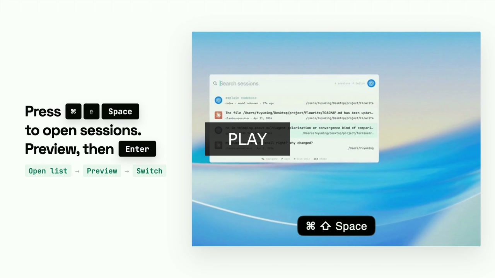

# VibeSpot

当你同时开了好几个 AI session 之后，想找到对的那个就会开始变慢。VibeSpot 不靠多 pane 去管理上下文，而是把搜索变成切换的最快方式，让你从一个原生命令面板里，在 live session 和旧 session 之间快速跳转。

[English](README.md) · [下载最新 Release](https://github.com/FUY25/vibespot/releases) · [发布说明](docs/RELEASING.md)

## 演示

[](https://fuy25.github.io/vibespot/demo.html)

[观看完整演示视频](https://fuy25.github.io/vibespot/demo.html)

### 随时唤起


### 快速切回 live session


### 模糊搜索旧会话


### 直接开始新会话


## 为什么做它

当你同时开了 3 个以上的 agent 或 session，原来的工作流就会开始失效：pane 太多，终端窗口太多，脑子里要记的上下文也太多。VibeSpot 用搜索来代替来回找窗口，让“搜索”本身就变成切换 live session 和找回旧上下文的最快方式。

## 功能

- 用 Spotlight 风格的面板搜索 Claude Code 和 Codex 的 live / 历史 session
- 按 `Enter` 直接跳回正在进行中的 live session
- 在恢复之前预览最近消息和改动过的文件
- 用关键词模糊搜索旧线程，而不是手动翻一堆窗口
- 在同一个入口里输入 `new claude` 或 `new codex`，直接开始新 session
- 默认只读取你机器上的本地 session 文件，不依赖云端同步

## 安装

### 方式一：Homebrew

```bash
brew tap FUY25/vibespot https://github.com/FUY25/vibespot.git
brew install --cask FUY25/vibespot/vibespot
```

这会通过 Homebrew 安装当前 GitHub Release 里的 DMG。当前打包版还没有接官方 Apple 签名和 notarization，所以 macOS 仍然可能要求你额外确认是否打开。

### 方式二：下载 Release

1. 打开 [最新 Release](https://github.com/FUY25/vibespot/releases)
2. 下载 `VibeSpot.dmg`
3. 把 `VibeSpot.app` 拖到 `/Applications`
4. 首次启动时按 macOS 提示完成信任确认
5. 完成 onboarding

注意：当前打包版还没有接官方 Apple 签名和 notarization，所以 macOS 可能会要求你额外确认是否打开。

### 方式三：从源码运行

```bash
git clone https://github.com/FUY25/vibespot.git vibespot
cd vibespot
./scripts/dev-run.sh
```

## 运行要求

- macOS 14+
- 本地已经用过 Claude Code 和/或 Codex
- `~/.claude` 和/或 `~/.codex` 下已经有 session 文件

## 它不是什么

- 不是云端同步产品
- 不是托管搜索服务
- 不是 Claude Code 或 Codex 的替代品
- 目前不是跨平台产品

## 开发

常用本地命令：

```bash
./scripts/dev-run.sh
./scripts/dev-run.sh --clean
./scripts/dev-run.sh --reset-onboarding
swift test
./scripts/package-app.sh
./scripts/create-dmg.sh
```

## 开源状态

VibeSpot 已经开源，也已经可以使用，但目前仍然偏早期。核心能力已经具备，剩下主要是体验打磨、打包发布、release 流程，以及面对公开用户的文档整理。

## License

[MIT](LICENSE)
